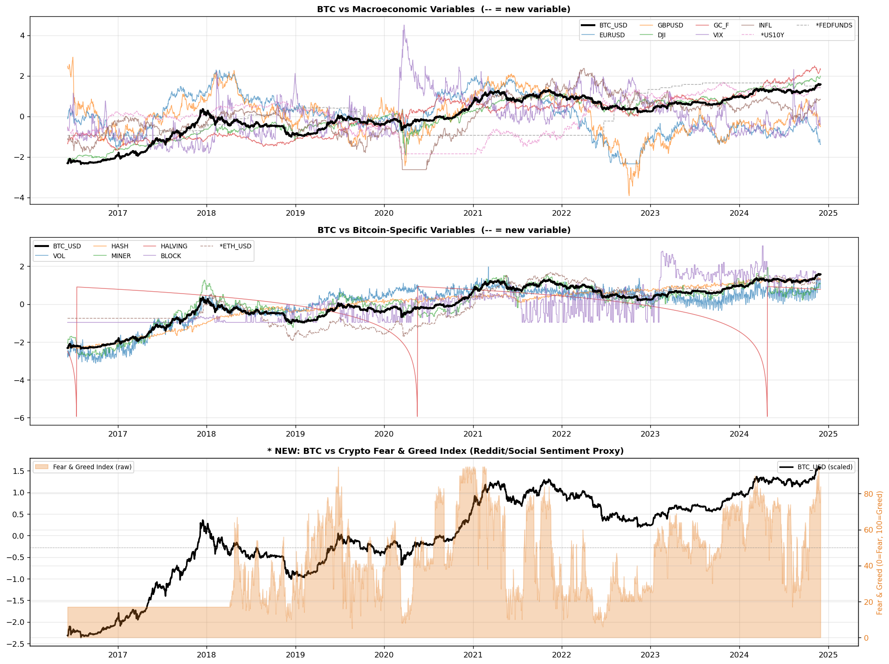
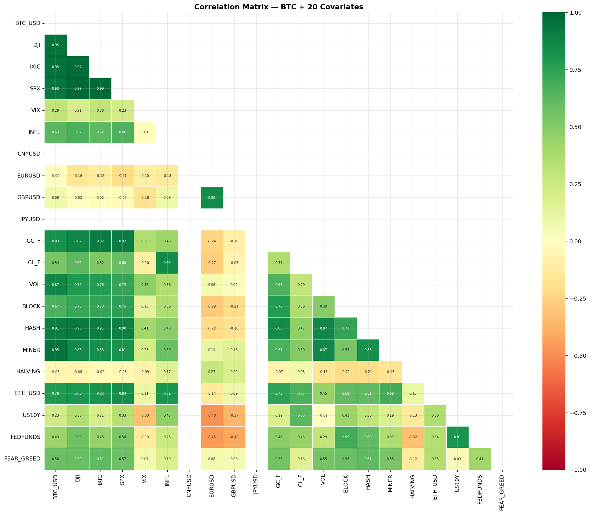
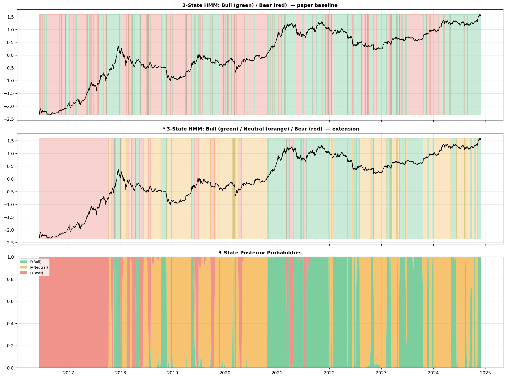
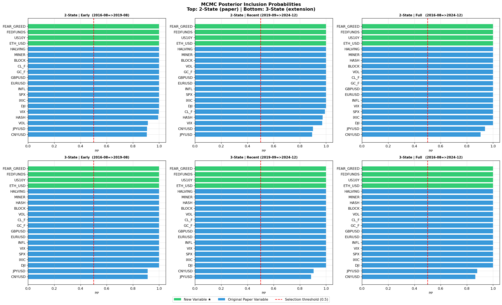
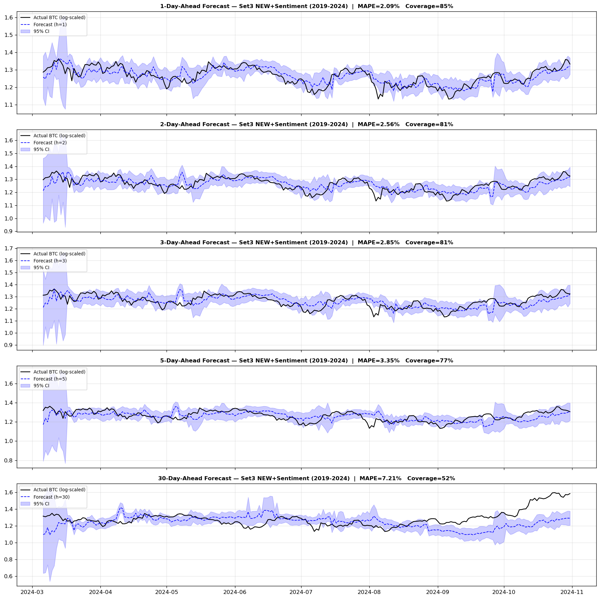
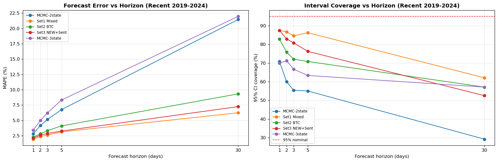

# Bitcoin Price Regime Shifts - Bayesian MCMC + Hidden Markov Model

Detecting bull/bear (and neutral) **regimes** in Bitcoin and forecasting the BTC price
across **multiple horizons** with a switching-regression Hidden Markov Model (HMM),
Bayesian MCMC variable selection, and rolling-window bootstrapped forecasts.

The full pipeline lives in [`Bitcoin_research.ipynb`](Bitcoin_research.ipynb).

---

## What this project does

1. **Pulls 20+ daily covariates** for 2016-08 -> 2024-11 from Yahoo Finance, Blockchain.com,
   FRED, and the Crypto **Fear & Greed Index** (a Reddit/Twitter/social-sentiment proxy).
2. **Fits a switching-regression HMM** (Baum-Welch EM) in both **2-state** (Bull/Bear, the
   paper baseline) and **3-state** (Bull/Neutral/Bear, our extension) variants.
3. **Selects variables with Bayesian MCMC** (simplified double reversible-jump), reporting
   Posterior Inclusion Probabilities (PIP) for both 2- and 3-state models.
4. **Forecasts the BTC price** with a rolling 80-day window and an 80-draw bootstrap that
   propagates regime uncertainty, evaluated across **five horizons: 1, 2, 3, 5 and 30 days**.

> **Update in this revision:** the forecasting engine previously evaluated only `h = 1, 5, 30`.
> It now evaluates **`h = 1, 2, 3, 5, 30`**, so the requested **2-day and 3-day** forecasts are
> included alongside 5-day and 30-day, with two new diagnostic figures
> (`forecast_multi_horizon.png`, `error_vs_horizon.png`).

---

## Data & variables

| Group | Variables |
|---|---|
| Macro / FX | DJI, IXIC, SPX, VIX, INFL, CNYUSD, EURUSD, GBPUSD, JPYUSD, GC_F (gold), CL_F (oil) |
| Bitcoin-specific | VOL, BLOCK (avg block size), HASH (hash-rate), MINER (miner revenue), HALVING (days-to-halving) |
| * New variables (extensions) | **ETH_USD** (crypto breadth), **US10Y** (10-yr Treasury), **FEDFUNDS** (policy rate), **FEAR_GREED** (social sentiment) |

All series are log-transformed, standardized, and lagged 7 days (as in the reference paper).
Target = standardized log `BTC_USD`.

### Exploratory analysis





---

## Regime detection (HMM)



| Model | Regimes (share of days) | Log-likelihood | **AIC** |
|---|---|---|---|
| 2-state (baseline) | Bull 60.1% / Bear 39.9% | 3480.5 | -6869.0 |
| **3-state (extension)** | Bull 37.6% / Neutral 43.3% / Bear 19.0% | 4029.8 | **-7915.6** |

The **3-state model fits the in-sample data better** (lower AIC) and isolates a *Neutral /
consolidation* regime distinct from directional Bull/Bear moves. All regimes are highly
persistent (transition-matrix diagonals 0.97-0.99), i.e. once in a regime, Bitcoin tends to
stay there.

---

## Variable selection (Bayesian MCMC)



Under the simplified MCMC, **essentially all 20 covariates clear the PIP >= 0.5 threshold** in
every sub-period - and crucially, **all four new variables (ETH_USD, US10Y, FEDFUNDS,
FEAR_GREED) are selected in every period and in both the 2- and 3-state models.** The
sentiment and rate variables carry genuine information about the regime process, not just noise.

---

## Multi-horizon forecasting (1, 2, 3, 5, 30 days) - the new part

Forecasts use a rolling 80-day training window. At each step the fitted HMM's last-state
posterior is propagated `h` steps through the transition matrix and combined with an 80-draw
bootstrap of the emission distribution to produce a point forecast and a 95% interval.
Five model variants are compared per period:

- **Set1 Mixed** `[CNYUSD, DJI, GC_F, VOL]` - paper macro benchmark
- **Set2 BTC** `[MINER, HASH, VOL, HALVING]` - paper Bitcoin-specific benchmark
- **\* Set3 NEW+Sent** `[ETH_USD, US10Y, FEDFUNDS, FEAR_GREED, VOL]` - sentiment extension
- **MCMC-2state** / **MCMC-3state** - every variable the MCMC selected (PIP >= 0.5)

### Forecast vs actual across all five horizons (best model, 2019-2024)



The 1-, 2- and 3-day forecasts track the actual price tightly with narrow intervals; the bands
visibly widen at 5 and especially 30 days as compounded regime uncertainty grows.

### Error and interval coverage as the horizon grows



### Results - Recent period (2019-09 -> 2024-11, last 350 obs)

**MAPE (%) - lower is better**

| Model | h=1 | **h=2** | **h=3** | h=5 | h=30 |
|---|---|---|---|---|---|
| Set1 Mixed | 1.96 | 2.30 | 2.58 | 3.11 | **6.20** |
| Set2 BTC | 2.24 | 2.78 | 3.35 | 4.10 | 9.37 |
| **\* Set3 NEW+Sent** | **1.90** | **2.35** | **2.66** | 3.16 | 7.82 |
| MCMC-2state (all vars) | 2.76 | 4.16 | 5.19 | 6.77 | 25.94 |
| MCMC-3state (all vars) | 3.05 | 4.62 | 6.02 | 7.76 | 25.13 |

**95% interval coverage (%) - closer to 95 is better**

| Model | h=1 | h=2 | h=3 | h=5 | h=30 |
|---|---|---|---|---|---|
| Set1 Mixed | 90.4 | 86.7 | 86.7 | 85.8 | 62.1 |
| Set2 BTC | 82.1 | 75.8 | 71.7 | 68.8 | 56.7 |
| \* Set3 NEW+Sent | 86.7 | 83.8 | 82.5 | 79.2 | 61.3 |
| MCMC-2state | 67.1 | 55.8 | 53.3 | 50.4 | 34.6 |
| MCMC-3state | 64.6 | 61.3 | 63.8 | 62.1 | 59.6 |

(The **Full 2016-2024** period is nearly identical to Recent - e.g. Set3 NEW+Sent MAPE
1.89 / 2.33 / 2.64 / 3.12 / 7.80 across the five horizons. The **Early 2016-2019** period shows
inflated MAPE because the standardized-log target sits near zero, making the percentage error
denominator tiny; MAE there is still small, so judge Early by MAE, not MAPE.)

---

## Analysis & key findings

1. **All four requested horizons are now produced.** The 2- and 3-day forecasts were the gap;
   they join the existing 5- and 30-day forecasts. The best model reaches **~2.3-2.7% MAPE at
   2-3 days**, only marginally above its 1-day error.

2. **Error grows monotonically and gently up to 5 days, then steeply by 30.** For Set3
   NEW+Sent: `1.9% -> 2.3% -> 2.7% -> 3.2% -> 7.8%` for `h = 1, 2, 3, 5, 30`. Short-horizon
   Bitcoin forecasting is accurate; month-ahead forecasting is roughly 4x harder.

3. **Sentiment + new variables help most at short horizons.** \* Set3 (with Fear & Greed,
   ETH, and rates) is the **single best model at h=1 (1.90% MAPE)** and stays competitive
   through 5 days. At 30 days the macro **Set1 Mixed** edges ahead (6.2% vs 7.8%), suggesting
   social sentiment is a *short-term* signal that decays over a month.

4. **Parsimony beats the kitchen sink.** Even though MCMC flags every variable as relevant,
   feeding *all 20* into the forecaster **overfits badly** - the MCMC sets are worst at every
   horizon and explode to **~25% MAPE at 30 days** vs ~6-8% for the curated 4-5 variable sets.
   Variable *selection* and forecast *parsimony* are different objectives.

5. **Intervals are too narrow at long horizons (a caveat).** Coverage is near nominal for
   1-day (~87-90%) but **decays to ~60% by 30 days** for every model. The bootstrap
   under-propagates compounding uncertainty over long horizons - a clear target for future work
   (e.g. horizon-specific variance inflation or a particle filter).

6. **3 states fit better but don't forecast better.** The 3-state HMM wins on in-sample AIC and
   adds an interpretable Neutral regime, yet its out-of-sample forecasts are no better (often
   worse) than the 2-state model - extra states buy description, not prediction.

---

## How to run

```bash
# environment used: conda env "asda-week2" (Python 3.10)
pip install yfinance requests scikit-learn scipy matplotlib seaborn tqdm nbconvert ipykernel

# run end-to-end and refresh all outputs + figures in place
jupyter nbconvert --to notebook --execute --inplace \
    --ExecutePreprocessor.timeout=-1 Bitcoin_research.ipynb
```

Data is fetched live (Yahoo Finance / Blockchain.com / FRED / alternative.me); the date range is
fixed at 2016-06 -> 2024-12, so results are reproducible. Full run ~ 5 minutes.

### Generated figures

| File | Description |
|---|---|
| `eda_all_vars.png` | BTC vs macro, Bitcoin-specific, and Fear & Greed sentiment |
| `corr_heatmap.png` | Correlation matrix of BTC + 20 covariates |
| `regimes_2v3_state.png` | 2-state vs 3-state regimes + posterior probabilities |
| `pip_2state_vs_3state.png` | MCMC posterior inclusion probabilities |
| **`forecast_multi_horizon.png`** | **1/2/3/5/30-day forecasts vs actual + 95% CI (new)** |
| **`error_vs_horizon.png`** | **MAPE & coverage vs horizon (new)** |
| `forecast_h1.png` | Standalone 1-step-ahead forecast |
